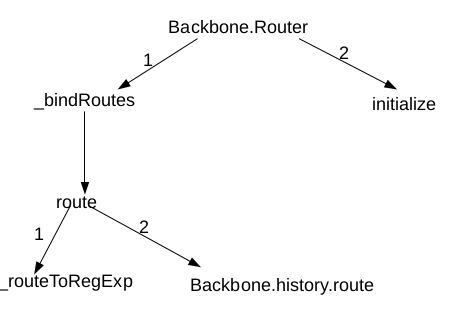

# The Fraustrating RegExp
The most tedious part of programming, is probably the regular expression, because it is just too complicated. One of the greatest features `Backbone` provides us, is the style of declarative routes & event handling. It abstracts away the complexity of regular expressions, and provides simple notations.

Firstly, as a reminder, when extending a router, routes can be defined in declarative syntax:

```js
var Router = new Backbone.Router.extend({
    routes: {
        "search/:query/p:page": "search",
        "file/*path": "file",
        "docs(/:chapter)": "docs"
    },

    search: function(query, page) {},
    file: function(path) {},
    docs: function(chapter) {}
});
```
For example, here are some urls can be matched:

- "search/books/p50"  - search("book", "50");
- "file/folder/router.js" - file("folder/router.js");
- "docs" - file("");

This means that routes can have parameters. `:param` matches a single parameter; `*param` matches any number of parameters; `(:param)` parameter wrapped in parentheses is optional. And we know that this match is performed by regular expressions. However, I'll take you to the fruastration...

## Router Part

You might need a call graph. Note that `Backbone.history` is an instance of `Backbone.History`, which handles whether to use `pushState` or hash fragments. I'll talk about that later.



#### Constructor

Let's first take a look at the first few lines of the router module:

```js
var Router = Backbone.Router = function(options) {
  options || (options = {});
  if (options.routes) this.routes = options.routes;
  this._bindRoutes();   // Bind routes we specified.
  this.initialize.apply(this, arguments);
};

var optionalParam = /\((.*?)\)/g;
var namedParam    = /(\(\?)?:\w+/g;
var splatParam    = /\*\w+/g;
var escapeRegExp  = /[\-{}\[\]+?.,\\\^$|#\s]/g;
```

- **optionalParam**: that's straight forward, anything wrapped inside parentheses is optional.
- **namedParam**: something like "(?:namedParam", or ":namedParam".
- **splatParam**: something like "*param". Match any number of params
- **escapeRegExp**:
    This one is not so straight forward. It took me time to find out what it is. As its name suggest, this regx matches some meta characters in regular expression:
    `-, {, }, [, ], +, ., comma, \, ^, $, #, whitespace` will be matched by this regx. You might be wondering there is not a back slash among: `\]+?.,`. It's find, MDN says they lose their special meanings inside a character set. some characters wrapped in a pair of bracket form a character set. An answear on stackoverflow has mentioned it, [go check it.](https://stackoverflow.com/questions/399078/what-special-characters-must-be-escaped-in-regular-expressions)

#### _bindRoutes & _routeToRegExp

Constructor simply calls `_bindRoutes` which in turn call `route` on each route of `this.routes`.

```js
_bindRoutes: function() {
  if (!this.routes) return;
  this.routes = _.result(this, 'routes');
  var route, routes = _.keys(this.routes);

  while ((route = routes.pop()) != null) {
    this.route(route, this.routes[route]);
  }
}
```

`route` method first convert each route to regx, by calling `_routeToRegExp`. Here's the `_routeToRegExp`:

```js
// Copy them here for you to reference them.
var optionalParam = /\((.*?)\)/g;
var namedParam    = /(\(\?)?:\w+/g;
var splatParam    = /\*\w+/g;
var escapeRegExp  = /[\-{}\[\]+?.,\\\^$|#\s]/g;

...
_routeToRegExp: function(route) {
                // escape meta character of RegExp.
  route = route.replace(escapeRegExp, '\\$&')
               .replace(optionalParam, '(?:$1)?')
               .replace(namedParam, function(match, optional) {
                 return optional ? match : '([^/?]+)';
               })
               .replace(splatParam, '([^?]*?)');
  return new RegExp('^' + route + '(?:\\?([\\s\\S]*))?$');
},
```
This is pretty fruastrating because I cannot completely understand it.
The first 2 `replace` calls can be understood. Here's what I found on MDN:

**Specifying a string as a parameter**

| Pattern | Inserts |
|---------|---------|
| $$ | Inserts a "$". |
| $& | Inserts the matched substring. |
| $` | Inserts the portion of the string that precedes the matched substring. |
| $n | Where n is a positive integer less than 100, inserts the nth parenthesized submatch string, provided the first argument was a RegExp object. Note that this is 1-indexed. |

Best way to understand it is examples. Assume we have a route

    `/employee[:name]/(id)`.

It might not be a good RESTful design, but whatever, it just serves as an example. After replaced by the first 2 strings, we got:

    /employee\[:name\]/(?:id)?

The 1st `replace` simply placed a backslash on meta character; the 2nd `replace` changed the optional param `(id)` into `(?:id)?`. This means if you got a url like "/employee[name]"

This is where it gets complex. `(?:id)` is a **non-capturing** group. If you're unfamiliar with **non-capturing** group, you need to check out [this post](https://stackoverflow.com/questions/3512471/what-is-a-non-capturing-group-what-does-do) before reading on.

After being processed by the 3rd `replace`, this is even more complex, because we have:

    employee\[([^/?]+)\]/(?:id)?

Why is this? because the part matched by `namedParam` is "[:name]", which has no group(If you're unfamiliar with the concept of group, go back to that link above to check it), thus the `optional` param passed to that replacement function is empty, & finally return `([^/?]+)`. If you have problem understanding `replace` method, you might need [this](https://developer.mozilla.org/en-US/docs/Web/JavaScript/Reference/Global_Objects/String/replace#Specifying_a_function_as_a_parameter).

This is pretty delicate, but hard to understand or express, because there is no concept of "named parameter" mentioned on the official docs. A "named parameter" can contain any character except "/" and "?" of any number; An "optional parameter" can contain anything.

The last `replace` is pretty straight forward. A "splat parameter" can contain any character except "?" of any number.

The last step is to append something which I cannot really understand & return a RegExp. So far each `route` is a RegExp that can be used to map urls internally.

#### route & _extractParameters

Next thing to take a look is `route` method. After converting `route` to a RegExp, it then delegates to `history.route`.

`history.route` is pretty simple. It only registers a call back to `history.handlers`. `history` is an object guarding for different state managemnts. But its implementation is quite complicated, too.


```js
route: function(route, name, callback) {
  // Convert `route` to RegExp
  if (!_.isRegExp(route)) route = this._routeToRegExp(route);
  
  // Might have 2 styles.
  if (_.isFunction(name)) {
    callback = name;
    name = '';
  }
  if (!callback) callback = this[name];

  // Delegate to `history.route`
  var router = this;
  Backbone.history.route(route, function(fragment) {
    var args = router._extractParameters(route, fragment);
    if (router.execute(callback, args, name) !== false) {
      router.trigger.apply(router, ['route:' + name].concat(args));
      router.trigger('route', name, args);
      Backbone.history.trigger('route', router, name, args);
    }
  });
  return this;
}

```
